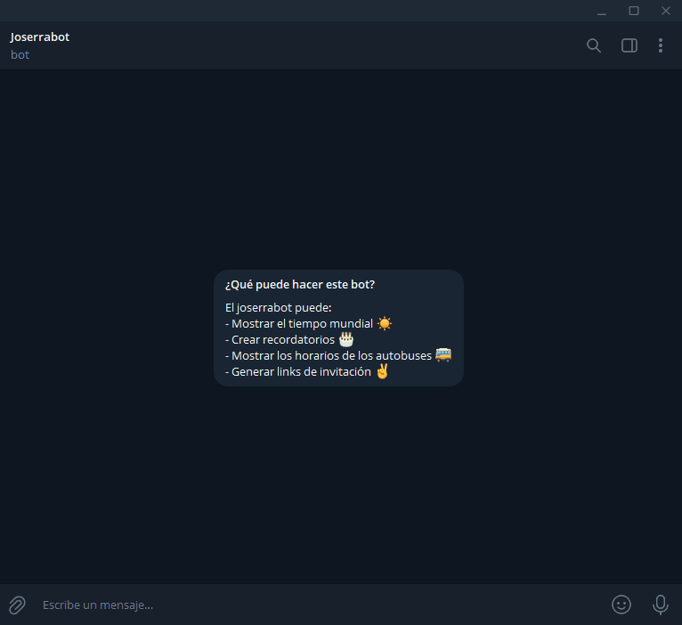

<div align="center">
    <b>Telegram bot made with NodeJS, TypeScript and GrammY to create reminders and check the weather</b>
</div>

<div align="center">
    <br/>
    
</div>

## Table of contents 👇

- [✨ Explanation](#-explanation)
- [🚀 Installation](#-installation)
- [🎨 Features](#-features)
- [🚩 Issues](#-issues)
- [🕸️ Vercel configuration](#-vercel-configuration)
- [💛 Contact](#-contact)

### ✨ Explanation

If you want to start to chat with the bot, simply search in Telegram for _@larguebot_ or _@joserrabot_. At the moment, the bot **only support private chats**, so you won't be able to add the bot to a group chat. To change that, go to `BotFather`, select your bot and go to _Bot Settings_ and then _Allow Groups_.

### 🚀 Installation

- `git clone`. Main and develop branches are currently the same.
- Go to `bot.ts` and uncomment the `bot.start()` line.
- Comment the code below `bot.start()`.
- `npm run dev` to run development server (local).

### 🎨 Features

- Weather forecast with [Open Weather Map](https://openweathermap.org/)
- Database of reminders with [Mongo Atlas Database](https://www.mongodb.com/atlas/database)
- Conversations with [GrammY Conversations](https://grammy.dev/plugins/conversations.html#simple-example)
- Internal [session storage](https://grammy.dev/plugins/session.html#sessions-and-storing-data-built-in)
- User authentication with custom password

### 🚩 Issues

[See this example](https://github.com/grammyjs/examples/tree/main/vercel-bot)

### 🕸️ Vercel Configuration

Create a `vercel.json` file in your root folder and add the following:

```json
{
  "functions": {
    "api/bot.ts": {
      "memory": 1024,
      "maxDuration": 10
    }
  }
}
```

This line `export default webhookCallback(bot, 'http');` at the end of the `bot.ts` file do the trick!

In vercel, set the following data:

- Output directory: `build`
- Install command: `npm install`

Set then the **environment variables**. Later, create the webhook with the following command. **Be sure to use the domain to your application**, I mean, avoid `https://joserrabot-d140bs3z9-jgcarrillo.vercel.app/` with the numbers and create the webhook with `https://joserrabot.vercel.app/`.

- Set the webhook: `https://api.telegram.org/bot{bot-key}/setWebhook?url={host-url}`

In this case the correct url to create the webhook is `https://joserrabot.vercel.app/api/bot`. Don't forget to add the `/api/bot` at the end of the URL of Vercel.

Other useful commands are:

- Info about webhook: `https://api.telegram.org/bot{bot-key}/getWebhookInfo`
- Delete webhook: `https://api.telegram.org/bot{bot-key}/deleteWebhook`

### 💛 Contact

If you have some doubts or need to ask something about the project, feel free to reach me here:

- Twitter: [https://twitter.com/jgcarrillo](https://twitter.com/jgcarrillo_)
- LinkedIn: [https://es.linkedin.com/in/jgcarrilloweb](https://es.linkedin.com/in/jgcarrilloweb)
- Website: [https://jgcarrillo.com/](https://jgcarrillo.com/)
